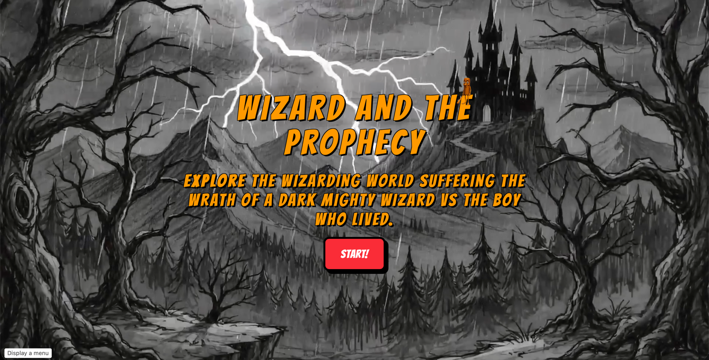
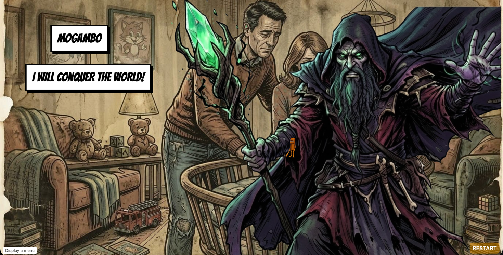
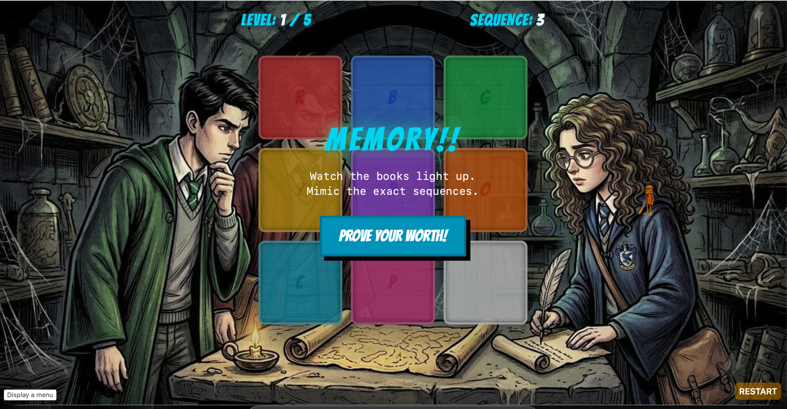

# WIZARD AND THE PROPHECY
- ### I created a interactive web comic on which user can interact with a comic by playing games and solving puzzle. 
- ### The web comic has animation, dialogues pop-up when they are supposed to audio playback when it is required and some character slides in slide out

## Interactivity and features
- Dynamic dialogues Display based on timeline (managed by scrolling position)
- Audio playback support for dialogues and background music also based on scrolling timeline
- Minigames and puzzles for interactions
- A Puzzle blocks the story path and you have to solve it to unlock the next path in the story.
- A Game's outcome (win or loss) will decide which path you are gonna go in the story.

## Tech
- React
- Framer Motion
- Tailwind CSS
- Google Flow for Assets

# Credit
- mixkit.co & Pixabay for free audio assets
- Google Flow for  assets Generation
- Story line inspired  form Harry Potter by J.K. Rowling

## I ended up removing the CSS scrolling snap feature because it was interfering with the framer motion, and I am here to find a solution to this problem, so I just removed it for now

View Live At
https://interactive-web-comic.vercel.app/

# Code Walkthrough
> This was my frist YSWS, i started with stardance, and i have not kept the commit messages very descriptive, so i will try to explain the code here.

- I decide to use react for the project as i am React fan nothing else and React >> svelte

## Idea
- I dont have any device to draw the assets for comic my self, also my drawing is very bad.
- but as jenny said using photo is allowed if we cant draw out own assets
- so i used `Google Flow` to generate assets for the comic, 
- i have used a scroll based-reveal animation to tell the story

## Core Scroll based animation
- i used framer motion to manage the scroll based animations
- used useScroll from framer-motion to manage scroll based animations.

## Scenes
- instead of hard coding the scenes, i created a mathod to write the details and dialouges of the scene in a config file.
- the my `app.txs` reads this config file and renders the scene bg, dialouges, and animations
- checkout `data/storyConfig.ts` for the story config file

## The Audio Engine
- audio files can be preloaded to paly them right on time
- there is also support of multiple audio being played at same time, max = 5,

# Code Explanation

## `useStore.ts`
- this custom hook, defines global state for zustand

## `assets.ts`
- this file imports all the assets and export a object mapping the assets  name to asset path

## `storyConfig.ts`
- this is the heart of the project, it contains everything that you see
- this uses object to store the data of story,and also manages timeline

## `audioEngine.ts`
- this file manages audio playback
- the audioEngine class has methods to preload the audio file and play/pause them

## `cn.ts`
- this contains  just a util function used to merger tailwind classes, with packaage "tailwind-merge"

## `App.tsx`
- this is the main entry file, you know what it is

## `LandingPage.tsx`
- this component is just a landing page shown before the story start, to show things like title and start buttons

# UI Elements
## `SpeechBubble.tsx`
- this component is used to show the dialogues, i pops up dynamically and can be positioned anywhere on the screen

## `ComicButton.tsx`
- simple button but in comic style, can be triggers into view based scroll position via timeline 

## `CaptionText.tsx`
- this component is used to show the caption text, it has a typewriter effect

## `CustomCursor.tsx`
- This basically changes the default cursor to a image.

## `SankeGame.tsx` & `SimonGame.tsx
- these are the minigames that i added for some interactivity,
- the snake game just ths classic one, but here the score defines the path you take in story.
- simon game is a more like a gate , you must complete it to proceed

made for Hackclub YSWS Program by @jane-does-coding